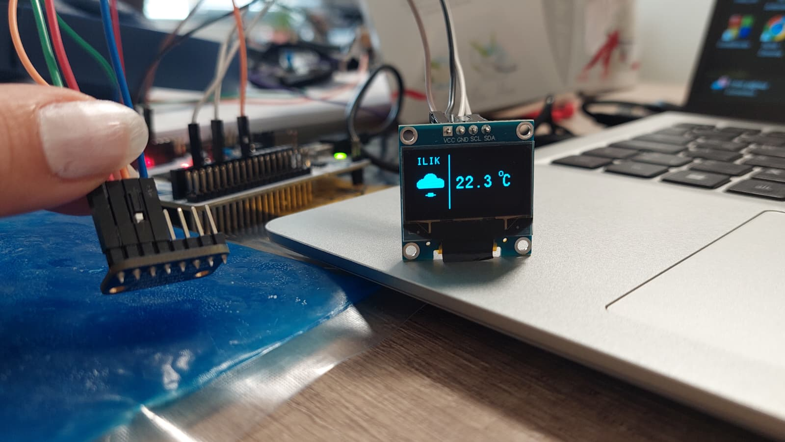

# STM32 MCP9808 Temperature Monitor & OLED Visualizer

This project implements a smart temperature monitoring system using the MCP9808 I2C sensor and an SSD1306 OLED display. It features dynamic icon rendering based on ambient temperature and critical alert thresholds.

## Features
- **High-Precision Sensing:** Uses MCP9808 (±0.25°C typical accuracy).
- **Dynamic Visualization:** Displays temperature-based icons (Sun, Cloud, Snowman) on the OLED screen.
- **Alert System:** Monitors user-defined upper, lower, and critical temperature limits.
- **Custom Graphics:** Bitmapped 32x32 icons rendered via custom buffer handling.

## Technical Architecture

- **Microcontroller:** STM32
- **Sensor:** MCP9808 (I2C)
- **Display:** SSD1306 OLED (I2C)
- **Language:** C (HAL Library)

## How It Works
1. **Communication:** The system uses I2C1 for the MCP9808 sensor and I2C2 (or 1) for the OLED.
2. **Data Processing:** Raw data from the sensor is converted into Celsius using bitwise manipulation.
3. **Logic:** - < 16°C: Snowman icon (Cold)
   - 16°C - 25°C: Cloud icon (Mild)
   - > 25°C: Sun icon (Hot)
4. **Alerts:** The software monitors bits in the sensor's temperature register to display "CRITICAL", "HIGH", or "LOW" warnings.

## License
Copyright (c) 2026 STMicroelectronics. Provided as-is.

---------------------------------------------------------------------------------------------------------------------------------------------------
# STM32 MCP9808 Sıcaklık İzleme & OLED Görselleştirici

Bu proje, MCP9808 I2C sıcaklık sensörü ve SSD1306 OLED ekran kullanarak geliştirilmiş akıllı bir sıcaklık izleme sistemidir. Ortam sıcaklığına göre dinamik olarak güncellenen simgeler (Güneş, Bulut, Kardan Adam) ve kritik sıcaklık uyarıları içerir.

## Proje Genel Bakış

## Özellikler
- **Yüksek Hassasiyet:** MCP9808 (tipik ±0.25°C doğruluk) kullanımı.
- **Dinamik Görselleştirme:** Sıcaklık değerine göre OLED ekran üzerinde otomatik değişen simgeler.
- **Uyarı Sistemi:** Kullanıcı tarafından tanımlanan alt, üst ve kritik sıcaklık limitlerinin takibi.
- **Özel Grafikler:** Bitmap tabanlı 32x32 piksel simgelerin ekran tamponuna (buffer) çizdirilmesi.

## Teknik Mimari
- **Mikrokontrolcü:** STM32
- **Sensör:** MCP9808 (I2C)
- **Ekran:** SSD1306 OLED (I2C)
- **Programlama Dili:** C (HAL Kütüphanesi)

## Çalışma Mantığı
1. **İletişim:** Sistem, MCP9808 sensörü için I2C1, ekran için I2C hatlarını kullanır.
2. **Veri İşleme:** Sensörden gelen ham veriler, bit düzeyinde işlemlerle (°C) cinsine dönüştürülür.
3. **Mantık:** - < 16°C: Kardan adam simgesi (Soğuk)
   - 16°C - 25°C: Bulut simgesi (Ilık)
   - > 25°C: Güneş simgesi (Sıcak)
4. **Alarmlar:** Sensörün durum kaydedicisi (register) anlık olarak izlenir; kritik, yüksek veya düşük ısı durumlarında ekrana uyarı yazılır.

## Lisans
Telif Hakkı (c) 2026 STMicroelectronics. "Olduğu gibi" sağlanmıştır.
